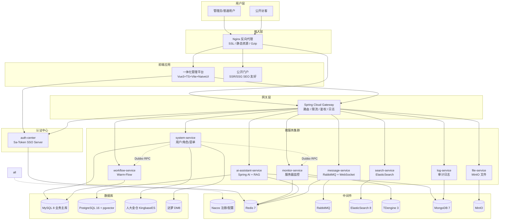

# 01 · 项目概述

## 1.1 项目背景

在企业数字化转型的过程中，几乎所有稍具规模的组织都会面临同一个问题：

> **"我们买了 10 套系统，员工每天要登录 10 次，密码还都不一样。"**

这就是 **单点登录（Single Sign-On, SSO）** 要解决的核心问题。而围绕 SSO，又会牵扯出一连串的工程问题：

- 用户在哪个系统登录？登录态如何共享？
- 用户从一个系统跳到另一个系统，怎么把身份带过去？
- 同一个账号在两台设备登录，要不要把前面的踢下线？
- 登录态过期了，前端如何无感知续期？
- 管理员停用了某个账号，所有系统如何实时感知？

围绕这些问题，本项目要做的不是一个"玩具 Demo"，而是一个 **可演进、可扩展、可学习** 的企业级一体化管理平台。

---

## 1.2 项目目标

### 1.2.1 业务目标

| 模块 | 目标 |
|------|------|
| **统一身份认证** | 一处登录、处处可用；一处注销、处处下线 |
| **基础平台** | 用户、角色、菜单、字典、参数、日志、定时任务等管理能力 |
| **服务器监控** | 实时采集 CPU/内存/JVM/磁盘指标，时序存储 + 大盘推送 |
| **工作流引擎** | 请假、报销、合同等审批流程的可视化设计与流转 |
| **AI 智能助手** | 基于企业知识库的 RAG 问答、文档总结、对话历史 |
| **消息中心** | RabbitMQ 事件总线 + WebSocket 实时推送 + 站内信 |
| **全文检索** | ElasticSearch 支持日志、知识库、文章检索 |
| **公开门户** | SEO/GEO 友好的对外内容站（博客、新闻、产品介绍） |

### 1.2.2 学习目标

把下面这些"简历热词"从概念变成代码：

- 微服务架构：**Nacos + Sentinel + Seata + Dubbo**
- 单点登录：**Sa-Token SSO 三模式 + 踢人下线**
- AI 工程：**Spring AI + RAG + pgvector + Embedding**
- 工作流：**Warm-Flow 7 表模型 + 流程设计器**
- 多数据源：**MySQL + PG + Mongo + ES + TDengine + 国产库**
- 实时通信：**Netty + WebSocket + RabbitMQ**
- 高并发缓存：**Redis + Redisson + Caffeine 多级缓存**
- 容器化部署：**Docker Compose + Nginx + CI/CD**

---

## 1.3 整体架构图（Mermaid）



---

## 1.4 模块关系说明

### 1.4.1 三个"用户接触点"

| 接触点 | 用户 | 前端 | 是否需要登录 |
|--------|------|------|--------------|
| `portal.example.com` | 公开访客 | 公开门户（SEO 友好） | 否 |
| `admin.example.com` | 管理员 | 一体化管理平台 | 是（必须经 SSO 登录） |
| `flow.example.com` / `ai.example.com` | 业务用户 | 子系统前端 | 是（SSO 免登跳转） |

### 1.4.2 后端服务的"四种角色"

1. **接入层服务**：Nginx（4-7 层代理）、Spring Cloud Gateway（路由 + 鉴权）
2. **认证中心**：auth-center（SSO Server），所有登录都先打到它
3. **业务微服务**：system / monitor / workflow / ai / message / search / file / log
4. **基础设施**：Nacos、Redis、MQ、ES、TDengine、MongoDB、MinIO、各数据库

### 1.4.3 数据流向举例（监控大盘刷新）

```
浏览器 → WebSocket 长连接 → monitor-service
                                  ↓
            monitor-agent 采集 → TDengine 存储 ← 历史查询
                                  ↓
            Netty Server 推送 → 浏览器大盘实时更新
```

---

## 1.5 项目命名建议

- **代号**：`aurora-platform`（极光平台，寓意"一体化、跨系统"）
- **顶级包名**：`com.aurora.platform`
- **Maven 顶级 groupId**：`com.aurora`
- **仓库结构**：多模块 Maven 工程 + 前端独立仓库（或 monorepo）

> 仓库命名示例：
> - 后端：`aurora-backend`
> - 前端（一体化平台）：`aurora-admin`
> - 前端（公开门户）：`aurora-portal`

---

## 1.6 与"学习"和"简历"的关系

本项目刻意把"技术广度"放在第一位，因此不会在某个单点钻到极深。但每个模块都会留出 **进阶方向** 与 **思考题**，例如：

- monitor-service 的 TDengine 表设计 vs InfluxDB 对比
- ai-assistant 的 RAG 切片策略：固定大小 vs 语义切片
- workflow-service 的多实例会签 vs Warm-Flow 内置的 node_ratio

把这些思考题的回答整理成博客，就是简历上的"项目亮点"。

---

下一步：[02 · 技术栈选型](./02-技术栈选型.md)
