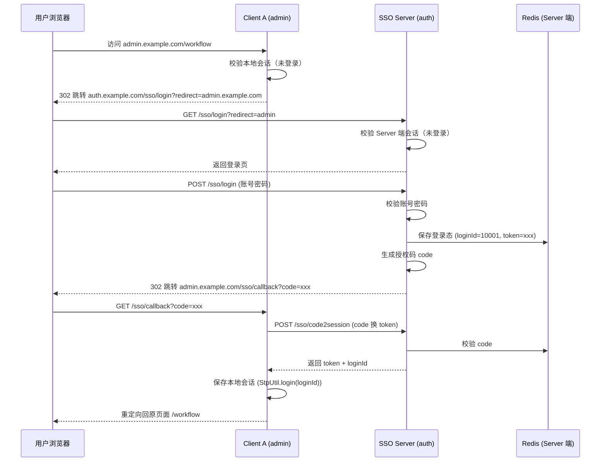
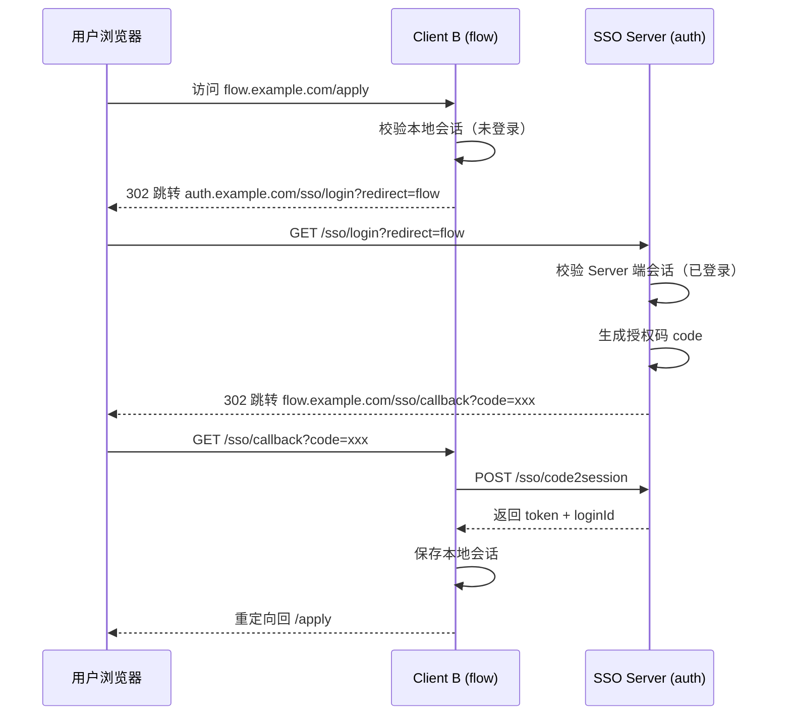
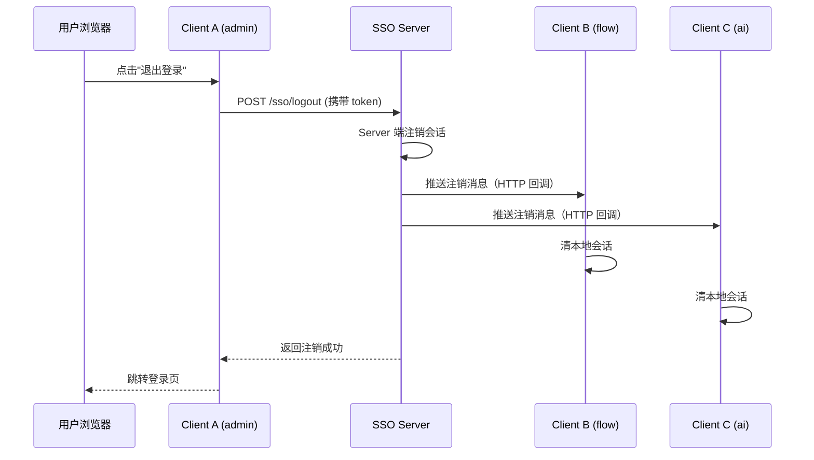
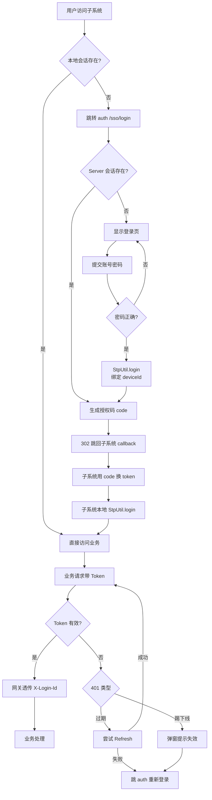

# 05 · 单点登录与会话管理

> 本文详细讲解本项目的 **SSO 单点登录**、**踢人下线**、**Token 续期**、**跨系统跳转** 的完整流程。
> 内容基于 Sa-Token 1.44.0 官方文档（context7 `/dromara/sa-token`）。

---

## 5.1 SSO 基本概念

### 5.1.1 什么是单点登录

> **Single Sign-On (SSO)**：用户只需在 **一个认证中心** 登录一次，即可访问所有互信应用（子系统）。
> 对应地，**Single Logout (SLO)**：在一处注销，所有子系统同步下线。

### 5.1.2 Sa-Token SSO 三种模式对比

| 模式 | 适用场景 | 共享 Redis | 跨域 | 实现难度 |
|------|----------|------------|------|----------|
| 模式一 | 同一域名下不同路径 + 共享 Redis | ✅ 必须 | ❌ | ★ |
| 模式二 | 不同域名 + Server 授权 Client 校验 | ❌ | ✅ | ★★★ |
| 模式三 | 不同域名 + 前端跨域 Token | ❌ | ✅ | ★★★★ |

### 5.1.3 本项目选型：模式二

**理由**：
- 各子系统是独立域名（`admin.example.com`、`flow.example.com`、`ai.example.com`）
- 不要求所有子系统共享 Redis（解耦更彻底）
- 实现难度适中，文档示例最多

---

## 5.2 角色定义

| 角色 | 域名 | 说明 |
|------|------|------|
| **SSO Server** | `auth.example.com` | 认证中心，登录入口、注销入口 |
| **SSO Client A** | `admin.example.com` | 一体化管理平台 |
| **SSO Client B** | `flow.example.com` | 工作流子系统 |
| **SSO Client C** | `ai.example.com` | AI 助手子系统 |

---

## 5.3 登录流程（时序图）

### 5.3.1 首次登录（用户访问 Client A，未登录）



### 5.3.2 二次跳转（已登录 Server，访问 Client B）



> 注意：第二次跳转中 **用户不需要再输密码**，因为 Server 端会话还在。

---

## 5.4 注销流程

### 5.4.1 单端注销（仅当前应用下线）

```java
@RequestMapping("/sso/logoutByAlone")
public Object logoutByAlone() {
    StpUtil.logout();  // 只清当前 Client 的本地会话
    return SaSsoClientProcessor.instance._ssoLogoutBack(
        SaHolder.getRequest(), SaHolder.getResponse());
}
```

### 5.4.2 全端注销（一处注销、全端下线）



### 5.4.3 单浏览器注销

```java
// 在登录时绑定 deviceId
String deviceId = SaHolder.getRequest().getParam("deviceId", SaFoxUtil.getRandomString(32));
StpUtil.login(10001, new SaLoginParameter().setDeviceId(deviceId));

// 单浏览器注销：只踢该设备
SaSsoServerUtil.ssoLogout(10001, logoutParameter, "ignoreClient");
```

---

## 5.5 踢人下线场景

### 5.5.1 场景一：同账号在第二台设备登录，踢第一台

**配置**：

```yaml
sa-token:
  is-concurrent: false        # 不允许同账号并发登录
  is-share: false             # 不共享 Token
  is-kickout: true            # 启用踢人下线
```

**效果**：
- 用户在 PC 上登录
- 用户在手机上登录 → 自动把 PC 上的会话踢下线
- PC 端下次请求收到 401 → 前端跳转登录

### 5.5.2 场景二：管理员主动踢人下线

```java
// 在线用户列表里点"强制下线"
@PostMapping("/sso/kickout")
public R<Void> kickout(Long userId, String deviceType) {
    StpUtil.kickout(userId, deviceType);
    return R.ok();
}
```

**效果**：
- 该用户在指定设备类型的所有 Token 立即失效
- 前端 WebSocket 收到 `kickout` 事件 → 弹窗提示 → 跳登录页

### 5.5.3 场景三：账号被封禁

```java
// 管理员封禁用户
StpUtil.logout(userId);  // 全端注销
```

---

## 5.6 Token 续期与过期

### 5.6.1 双 Token 机制（推荐）

```
Access Token  → 有效期 2h，每次请求带它
Refresh Token → 有效期 7d，过期前用它换新 Access Token
```

**Sa-Token 实现**：

```yaml
sa-token:
  timeout: 7200        # 2h（Access Token）
  active-timeout: -1   # 不活跃超时（-1 表示不限制）
  is-share: false
```

**前端拦截器逻辑**：

```typescript
// 401 拦截
if (res.code === 401) {
  const refreshToken = getRefreshToken();
  if (refreshToken) {
    const newToken = await api.refresh(refreshToken);
    setToken(newToken);
    return retry(originalRequest);
  }
  // Refresh 也过期 → 跳登录
  window.location.href = 'https://auth.example.com/sso/login?redirect=' + location.origin;
}
```

### 5.6.2 跳转回一体化登录中心的逻辑

> 用户的核心诉求：
> **"其他系统登录到期或者被踢下线后需要重新跳转到一体化系统重新登录"**

**前端拦截器（子系统）**：

```typescript
// axios 全局拦截器
service.interceptors.response.use(
  res => res,
  async err => {
    if (err.response?.status === 401) {
      const code = err.response.data?.code;
      if (code === 40101) {
        // Token 过期，尝试 Refresh
        const refreshed = await tryRefresh();
        if (refreshed) return retry(err.config);
      }
      if (code === 40102) {
        // 被踢下线 → 提示并跳转
        ElMessageBox.alert('您的登录已失效，请重新登录', '提示', {
          confirmButtonText: '重新登录',
          callback: () => redirectSSO()
        });
      }
    }
    return Promise.reject(err);
  }
);

function redirectSSO() {
  const redirect = encodeURIComponent(window.location.href);
  window.location.href = `https://auth.example.com/sso/login?redirect=${redirect}`;
}
```

---

## 5.7 网关鉴权与子服务透传

### 5.7.1 网关层（Gateway）

```yaml
spring:
  cloud:
    gateway:
      routes:
        - id: system
          uri: lb://aurora-system
          predicates: [Path=/api/system/**]
          filters:
            - StripPrefix=2
            - name: SaToken   # 自定义过滤器工厂
              args:
                excludePaths: /api/system/public/**
```

**自定义 SaToken 过滤器工厂**：

```java
@Component
public class SaTokenGatewayFilterFactory extends AbstractGatewayFilterFactory<Object> {
    @Override
    public GatewayFilter apply(Object config) {
        return (exchange, chain) -> {
            ServerHttpRequest req = exchange.getRequest();
            String token = req.getHeaders().getFirst(SatokenContext.TOKEN_HEADER);
            Object loginId = StpUtil.getLoginIdByToken(token);
            if (loginId == null) {
                return unauthorized(exchange, "Token 无效或已过期");
            }
            // 透传 loginId 给下游服务
            ServerHttpRequest mutated = req.mutate()
                .header("X-Login-Id", loginId.toString())
                .build();
            return chain.filter(exchange.mutate().request(mutated).build());
        };
    }
}
```

### 5.7.2 子服务层（透传上下文）

下游服务通过 `aurora-common-satoken` 模块的 `SaTokenContextFilter` 把 `X-Login-Id` 头设置到 Sa-Token 上下文：

```java
@Component
public class SaTokenContextFilter extends OncePerRequestFilter {
    @Override
    protected void doFilterInternal(HttpServletRequest req, HttpServletResponse resp, FilterChain chain) {
        String loginId = req.getHeader("X-Login-Id");
        if (loginId != null) {
            SaTokenContext.setLoginId(loginId);
        }
        chain.doFilter(req, resp);
    }
}
```

> 这样下游服务可以直接 `StpUtil.getLoginIdAsLong()` 拿到当前用户 ID，无需再次鉴权。

---

## 5.8 在线用户管理

### 5.8.1 数据结构（Redis）

Sa-Token 默认用 Redis 存储会话：

```
satoken:login:token          → Set<String>      （token 集合）
satoken:login:session:10001  → SaSession        （用户会话）
satoken:login:last-active:10001 → Long          （最后活跃时间）
```

### 5.8.2 在线用户列表 API

```java
@GetMapping("/sso/online")
public Page<OnlineUserVO> online(OnlineQuery query) {
    List<String> tokenList = StpUtil.searchTokenValue("", 0, -1, false);
    List<OnlineUserVO> list = tokenList.stream()
        .map(token -> {
            Object loginId = StpUtil.getLoginIdByToken(token);
            SaSession session = StpUtil.getSessionByLoginId(loginId);
            return OnlineUserVO.builder()
                .tokenId(token)
                .userId((Long) loginId)
                .deviceType(session.getDeviceType())
                .loginTime(session.getCreateTime())
                .lastActive(session.getLastAccessedTime())
                .ip(session.get("ip"))
                .location(IpUtils.getRealAddressByIp(session.get("ip")))
                .build();
        })
        .filter(vo -> matchQuery(vo, query))
        .collect(Collectors.toList());
    return PageUtil.list2Page(list, query.getPageNum(), query.getPageSize());
}

@PostMapping("/sso/kickout")
public R<Void> kickout(String token) {
    StpUtil.kickoutByTokenValue(token);
    return R.ok();
}
```

---

## 5.9 OAuth2（开放平台）

### 5.9.1 场景

第三方应用（如 GitHub、飞书）想接入你的系统，可以用 OAuth2 授权码模式。

### 5.9.2 流程

```
1. 第三方应用引导用户跳转：
   GET https://auth.example.com/oauth2/authorize?client_id=xxx&redirect_uri=xxx&state=xxx

2. 用户在 auth 登录并同意授权

3. auth 跳回第三方回调：
   GET https://third-party.com/callback?code=xxx&state=xxx

4. 第三方后端用 code 换 token：
   POST https://auth.example.com/oauth2/token
   Body: client_id, client_secret, code, grant_type=authorization_code

5. 第三方用 token 获取用户信息：
   GET https://auth.example.com/oauth2/userinfo
   Header: Authorization: Bearer xxx
```

### 5.9.3 Sa-Token 实现

```java
// 1. 注册客户端
SaOAuth2ServerManager.getConfig()
    .setClientList(client -> {
        return new SaOAuth2Client()
            .setClientId("third-party-app")
            .setClientSecret("secret-xxx")
            .setAllowGrantTypes("authorization_code", "refresh_token")
            .setAllowUrls("https://third-party.com/callback");
    });

// 2. 授权 + 颁发 code
@RequestMapping("/oauth2/authorize")
public Object authorize() {
    return SaOAuth2Manager.getConfig().getAuthorize();
}

// 3. code 换 token
@RequestMapping("/oauth2/token")
public Object token() {
    return SaOAuth2Manager.getConfig().getToken();
}

// 4. 获取用户信息
@RequestMapping("/oauth2/userinfo")
public Object userinfo() {
    return SaOAuth2Manager.getConfig().getUserinfo();
}
```

---

## 5.10 完整登录流程示意（一张图）



---

## 5.11 安全加固清单

| 项 | 措施 |
|----|------|
| 密码存储 | BCrypt 加盐（cost=10） |
| 密码传输 | 全站 HTTPS + 前端 RSA 加密密码字段 |
| 登录失败 | 5 次锁定 15 分钟（Redisson 计数） |
| 验证码 | 滑动验证码（如 tianai-captcha） |
| Token 长度 | Sa-Token 默认 64 字符随机串 |
| 防重放 | 请求头加 timestamp + nonce + sign |
| XSS | Vue 默认转义 + DOMPurify 处理富文本 |
| CSRF | Sa-Token Token 模式天然防 CSRF |
| SQL 注入 | MyBatis-Plus 参数化查询 |
| 越权 | 数据权限拦截器 + 接口级 @SaCheckPermission |

---

下一步：[06 · 多数据库与多数据源](./06-多数据库与多数据源.md)
