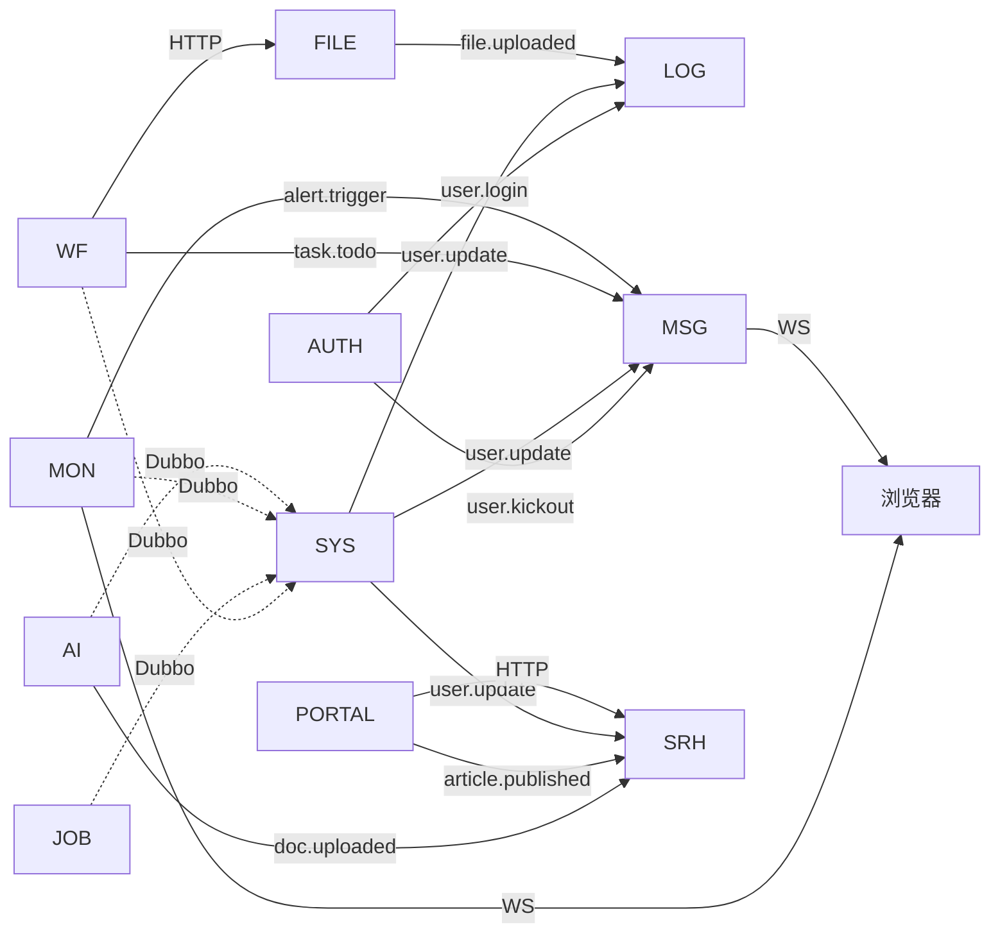

# 09 · 项目需求文档（按服务逐个详细说明）

> 本文档是项目的"主需求书"，按 13 个微服务逐一展开：
> **服务定位 → 核心需求 → 模块划分 → 每个模块功能 → 用到的技术栈 → 关键接口 → 数据模型 → 服务间关系**。
>
> 配套文档：
> - 工程结构：[10 · IDEA 与工程结构](./10-IDEA与工程结构.md)
> - 架构总览：[04 · 服务架构设计](./04-服务架构设计.md)
> - 选型版本号：[02 · 技术栈选型](./02-技术栈选型.md)

---

## 9.1 总体需求概览

### 9.1.1 项目愿景

构建一个**一体化企业管理平台**作为统一入口：
- 管理员登录一次后，可免登跳转到工作流、AI 助手、报表等多个子系统
- 当登录态过期或被踢下线时，自动跳回一体化登录中心
- 平台自身集成：系统管理、服务器监控、工作流审批、AI 知识库问答、消息推送、全文检索、文件管理、低代码报表、定时任务

### 9.1.2 用户角色

| 角色 | 描述 | 主要场景 |
|------|------|----------|
| 超级管理员 | 全权限 | 配置菜单、角色、字典、监控大盘、报表设计 |
| 系统管理员 | 系统管理权限 | 用户、角色、参数管理 |
| 业务审批人 | 部门经理/HR/财务 | 处理审批任务 |
| 普通员工 | 申请发起人 | 发起请假/报销/合同申请 |
| 公开访客 | 未登录用户 | 浏览公开门户（博客、新闻、产品介绍） |

### 9.1.3 服务清单（13 个微服务）

| # | 服务 | 端口 | 类型 | 核心需求摘要 |
|---|------|------|------|--------------|
| 0 | aurora-gateway | 8080 | 网关 | 路由转发、鉴权、限流、跨域、灰度 |
| 1 | aurora-auth | 8081 | 认证 | 登录、SSO Server、踢人下线、OAuth2 |
| 2 | aurora-system | 8082 | 业务 | 用户/角色/菜单/部门/字典/参数/通知 |
| 3 | aurora-monitor | 8083 | 业务 | 服务器监控、TDengine、WebSocket 推送 |
| 4 | aurora-workflow | 8084 | 业务 | Warm-Flow 4 类审批流程 |
| 5 | aurora-ai | 8085 | 业务 | RAG 知识库问答、SSE 流式 |
| 6 | aurora-message | 8086 | 基础设施 | RabbitMQ 消费、WebSocket 推送、站内信 |
| 7 | aurora-search | 8087 | 基础设施 | ElasticSearch 全文检索 |
| 8 | aurora-file | 8088 | 基础设施 | MinIO 上传/下载/预览 |
| 9 | aurora-log | 8089 | 基础设施 | 操作日志、登录日志、审计 |
| 10 | aurora-portal | 8090 | 业务 | 公开门户（博客/新闻/SEO） |
| 11 | aurora-job | 8091 | 基础设施 | XXL-JOB 执行器 |
| 12 | aurora-report | 8092 | 业务 | JimuReport 报表设计 |

---

## 9.2 aurora-gateway（网关服务）

### 9.2.1 服务定位
统一 API 入口，所有 `/api/**` 请求先经过网关，做路由、鉴权、限流、跨域。

### 9.2.2 核心需求
1. 把 `/api/system/**` 转发到 aurora-system，其他服务同理
2. 校验 Token，无效返回 401，有效把 `loginId` 透传到下游
3. 按 IP / 用户 / 路由 三个维度限流
4. 处理跨域（CORS）
5. 记录请求 / 响应日志、慢请求标记
6. 支持灰度路由（按请求头 `X-Gray-Version` 路由到 v2 实例）

### 9.2.3 模块与功能

| 模块 | 功能 |
|------|------|
| 路由模块 | 基于 `application.yml` + Nacos 动态路由；路由元数据从 Nacos 拉 |
| 鉴权模块 | 自定义 `SaTokenGatewayFilterFactory`，校验 Sa-Token，透传 `X-Login-Id` |
| 限流模块 | Sentinel 网关流控规则，按路由名 / API 分组 |
| 跨域模块 | 全局 `CorsWebFilter` |
| 日志模块 | 全局过滤器记录请求/响应，超过 1s 标记 slow |
| 灰度模块 | 自定义 `RouteLocator` + Predicate，按 header 路由 |

### 9.2.4 技术栈

- Spring Cloud Gateway 4.x（响应式，基于 Netty）
- Spring Cloud Alibaba Sentinel（限流）
- Sa-Token Spring Cloud3 Gateway 适配
- Springdoc-openapi（聚合所有服务的 API 文档，gateway 端配置）

### 9.2.5 关键接口

| 方法 | 路径 | 说明 |
|------|------|------|
| - | `/api/**` | 所有业务请求入口 |
| GET | `/actuator/health` | 健康检查 |
| GET | `/actuator/prometheus` | Prometheus 指标 |
| GET | `/v3/api-docs` | 聚合 OpenAPI 文档 |

### 9.2.6 数据模型
- 无业务表
- 路由配置存 Nacos（`aurora-gateway.yaml`）

### 9.2.7 服务间关系
- 上游：Nginx
- 下游：所有业务服务
- 依赖：Nacos、Redis、Sentinel Dashboard

---

## 9.3 aurora-auth（认证中心 / SSO Server）

### 9.3.1 服务定位
统一身份认证中心，提供登录、SSO Server、踢人下线、OAuth2、会话治理。

### 9.3.2 核心需求
1. 账号密码登录 + 滑动验证码
2. 手机短信登录 / 邮箱验证码登录
3. **SSO 模式二**：颁发授权码 → Client 用 code 换 token → Server 校验
4. 踢人下线：管理员强制下线指定用户/设备
5. 在线用户列表 + 会话详情
6. OAuth2：第三方应用接入（授权码、客户端凭证）
7. Refresh Token 续期
8. 登录失败 5 次锁定 15 分钟
9. 密码修改后全端注销

### 9.3.3 模块与功能

| 模块 | 功能 |
|------|------|
| 登录模块 | 账号密码、短信、邮箱、扫码 4 种登录方式 |
| 验证码模块 | 滑动验证码（tianai-captcha）、图形验证码 |
| SSO Server 模块 | 授权码颁发、code2session、单端/全端注销 |
| OAuth2 模块 | 授权码模式、客户端凭证、Refresh Token |
| 会话治理 | 在线用户、强制下线、Token 续期 |
| 风控模块 | 登录失败计数、IP 黑名单、异地登录告警 |
| 第三方登录 | 微信、GitHub、Google OAuth2（可选） |

### 9.3.4 技术栈

- Sa-Token 1.44.0（`sa-token-spring-boot3-starter`、`sa-token-sso`、`sa-token-oauth2`）
- tianai-captcha（滑动验证码）
- Redisson（分布式锁 + 限流，登录失败计数）
- Redis（会话存储）
- Caffeine（短期本地缓存登录配置）

### 9.3.5 关键接口

| 方法 | 路径 | 说明 |
|------|------|------|
| POST | `/sso/login` | 账号密码登录 |
| POST | `/sso/login/sms` | 短信登录 |
| POST | `/sso/login/email` | 邮箱登录 |
| POST | `/sso/logout` | 全端注销 |
| POST | `/sso/logoutByAlone` | 单端注销 |
| GET | `/sso/online` | 在线用户列表 |
| POST | `/sso/kickout` | 踢人下线 |
| GET | `/sso/captcha` | 获取验证码 |
| POST | `/oauth2/authorize` | OAuth2 授权 |
| POST | `/oauth2/token` | 颁发 Token |
| GET | `/oauth2/userinfo` | 获取用户信息 |
| POST | `/sso/refresh` | Refresh Token |

### 9.3.6 数据模型

- 主要表：`sys_user`（密码字段 BCrypt 加密）
- Redis Key：
  - `satoken:login:session:{loginId}` 用户会话
  - `satoken:login:token:{token}` Token → loginId 映射
  - `auth:login:fail:{username}` 登录失败计数（TTL 15min）
  - `auth:captcha:{key}` 验证码缓存

### 9.3.7 服务间关系
- 上游：Gateway
- 下游：aurora-system（查用户）、aurora-message（发短信/邮件）
- 依赖：Redis、MongoDB（登录日志）、RabbitMQ（事件 `user.login`、`user.kickout`）

---

## 9.4 aurora-system（系统管理服务）

### 9.4.1 服务定位
项目"地基"——所有系统级配置、权限、字典都在这里。其他服务通过 Dubbo 调它的接口。

### 9.4.2 核心需求
1. 用户全生命周期：CRUD、重置密码、启用/禁用、分配角色
2. 角色管理：CRUD、分配菜单、数据权限范围
3. 菜单管理：树形菜单、按钮权限、路由元数据（前端动态路由用）
4. 部门管理：树形结构、行级数据权限
5. 岗位管理
6. 字典管理：字典类型 + 字典数据（前端下拉框数据源）
7. 参数管理：系统参数（含 Nacos 配置项镜像）
8. 通知公告：发布、已读未读
9. 数据权限：行级数据权限拦截器（基于 SQL）

### 9.4.3 模块与功能

| 模块 | 功能点 |
|------|--------|
| 用户模块 | 用户 CRUD、重置密码、启用禁用、导入导出 Excel、分配角色 |
| 角色模块 | 角色 CRUD、菜单分配、数据权限（部门级）、岗位分配 |
| 菜单模块 | 菜单树 CRUD、按钮权限标识、路由元数据、缓存策略 |
| 部门模块 | 部门树 CRUD、负责人、数据权限范围（自己/本部门/本部门及以下/全部） |
| 岗位模块 | 岗位 CRUD、用户-岗位关联 |
| 字典模块 | 字典类型 CRUD、字典数据 CRUD、前端通过 `/dict/data/{type}` 拉取 |
| 参数模块 | 参数 CRUD、参数缓存（Redis）、与 Nacos 配置镜像 |
| 通知模块 | 通知 CRUD、已读未读、全员/指定人发布 |
| 数据权限 | MyBatis-Plus 拦截器 + 注解 `@DataScope` |

### 9.4.4 技术栈

- Spring Boot 3.5
- MyBatis-Plus 3.5.9（含分页、多租户、数据权限拦截器）
- dynamic-datasource 4.3（主库 MySQL，备 KingbaseES/DM）
- Caffeine + Redis（多级缓存字典数据）
- Dubbo 3.3（对外暴露 `UserService`、`DeptService` 等 RPC 接口）
- EasyExcel（用户导入导出）
- springdoc-openapi（API 文档）

### 9.4.5 关键接口

| 方法 | 路径 | 说明 |
|------|------|------|
| GET | `/system/user/page` | 用户分页 |
| POST | `/system/user` | 新增用户 |
| PUT | `/system/user` | 修改用户 |
| DELETE | `/system/user/{id}` | 删除用户 |
| POST | `/system/user/resetPwd` | 重置密码 |
| POST | `/system/user/import` | 导入 Excel |
| GET | `/system/user/export` | 导出 Excel |
| GET | `/system/role/page` | 角色分页 |
| POST | `/system/role` | 新增角色 |
| GET | `/system/menu/tree` | 菜单树 |
| GET | `/system/menu/routes` | 前端路由（按当前用户权限） |
| GET | `/system/dept/tree` | 部门树 |
| GET | `/system/dict/data/{type}` | 按类型查字典数据 |
| GET | `/system/notice/page` | 通知分页 |
| PUT | `/system/notice/read/{id}` | 标记已读 |

### 9.4.6 数据模型

```
sys_user                系统用户（含 username/password/status/dept_id）
sys_role                角色（含 data_scope 数据权限范围）
sys_menu                菜单（含 parent_id/path/component/perms/icon）
sys_dept                部门（树形 parent_id/ancestors）
sys_post                岗位
sys_user_role           用户-角色关联
sys_role_menu           角色-菜单关联
sys_role_dept           角色-部门（数据权限）
sys_user_post           用户-岗位关联
sys_dict_type           字典类型
sys_dict_data           字典数据
sys_config              系统参数
sys_notice              通知
sys_notice_read         通知已读
```

### 9.4.7 服务间关系
- 上游：Gateway、所有需要用户/部门/字典数据的服务（通过 Dubbo RPC）
- 依赖：MySQL、Redis、Nacos
- 调用：发用户变更事件到 RabbitMQ（`user.update`），其他服务订阅刷新缓存

---

## 9.5 aurora-monitor（服务器监控服务）

### 9.5.1 服务定位
采集服务器 / JVM 指标，存时序库，通过 WebSocket 推送到前端大盘。

### 9.5.2 核心需求
1. 实时采集：CPU、内存、磁盘、网络、JVM 堆/非堆/线程/GC
2. 多服务多实例：每个微服务一个 monitor-agent 上报
3. 时序存储：写入 TDengine 超级表
4. 实时推送：Netty WebSocket，端口 9090
5. 历史查询：1h / 24h / 7d / 30d 趋势曲线
6. 阈值告警：CPU > 80% / 内存 > 90% → RabbitMQ → message-service 推送
7. 自定义指标：业务指标（订单量、对话数）也走同一通道

### 9.5.3 模块与功能

| 模块 | 功能 |
|------|------|
| 采集模块 | OSHI 采集本机指标；接收 monitor-agent 上报其他服务指标 |
| 存储模块 | TDengine 超级表 `aurora_metrics`，按服务+实例标签 |
| 推送模块 | Netty Server，按 `userId → Channel` 推送实时指标 |
| 历史查询 | 按 service_name + 时间范围查询，返回时间序列数据 |
| 告警模块 | 阈值规则（Nacos 配置）→ 命中发 MQ → message-service 推送 |
| Prometheus 整合 | 本服务也暴露 `/actuator/prometheus` 给 Prometheus 拉 |

### 9.5.4 技术栈

- OSHI 6.6（系统信息采集）
- TDengine 3.3.2.0 + taos-jdbcdriver
- Netty 4.1（WebSocket Server）
- Spring Boot Actuator + micrometer-registry-prometheus
- RabbitMQ（发告警事件）

### 9.5.5 关键接口

| 方法 | 路径 | 说明 |
|------|------|------|
| GET | `/monitor/realtime` | 当前所有服务最新指标 |
| GET | `/monitor/history` | 按 service_name + 时间范围查历史 |
| GET | `/monitor/services` | 列出所有被监控服务 |
| GET | `/monitor/alerts` | 当前活跃告警 |
| WS | `/ws/monitor/{userId}` | WebSocket 订阅实时指标 |
| GET | `/actuator/prometheus` | Prometheus 拉取 |

### 9.5.6 数据模型

- TDengine 超级表 `aurora_metrics`（见 06 章 6.5.4）
- MySQL `biz_alert_rule` 告警规则表
- Redis `monitor:alert:{service}:{metric}` 告警状态（去抖）

### 9.5.7 服务间关系
- 上游：所有微服务（带 monitor-agent 上报）
- 下游：aurora-message（告警推送）
- 依赖：TDengine、Redis、RabbitMQ

---

## 9.6 aurora-workflow（工作流服务）

### 9.6.1 服务定位
基于 Warm-Flow 实现 4 类典型审批流程。

### 9.6.2 核心需求
1. 流程定义：导入 JSON、可视化设计器、发布、停用、版本管理
2. 流程实例：发起、撤销、催办
3. 任务处理：审批、驳回、转办、委托、加签、减签、会签
4. 待办 / 已办 / 我发起的
5. 历史查询：实例历史、流转记录
6. 业务流程：请假、报销、合同审批、采购申请

### 9.6.3 模块与功能

| 模块 | 功能 |
|------|------|
| 流程定义模块 | 导入 JSON、发布、停用、版本管理、设计器接口 |
| 流程实例模块 | 发起（业务 ID 关联）、撤销、催办 |
| 任务模块 | 待办、已办、审批、驳回、转办、委托、加签、减签 |
| 历史模块 | 实例历史、节点流转记录、审批轨迹 |
| 请假业务 | 发起表单（含起止时间、类型、原因、附件） |
| 报销业务 | 发起表单（含金额、明细、发票） |
| 合同业务 | 起草、法务审核、领导审批、归档 |
| 采购业务 | 申请、采购员、出纳、归档 |

### 9.6.4 技术栈

- Warm-Flow 1.8.8（`warm-flow-mybatis-plus-sb3-starter`）
- MyBatis-Plus（业务表）
- Dubbo（调用 aurora-system 查用户/部门）
- RabbitMQ（任务待办事件 → aurora-message 推送）
- MinIO（审批附件）

### 9.6.5 关键接口

| 方法 | 路径 | 说明 |
|------|------|------|
| POST | `/workflow/def/import` | 导入流程定义 JSON |
| GET | `/workflow/def/page` | 流程定义分页 |
| POST | `/workflow/def/publish/{id}` | 发布流程 |
| POST | `/workflow/ins/start` | 发起流程实例 |
| GET | `/workflow/task/todo` | 我的待办 |
| GET | `/workflow/task/done` | 我的已办 |
| POST | `/workflow/task/pass` | 审批通过 |
| POST | `/workflow/task/reject` | 驳回 |
| POST | `/workflow/task/transfer` | 转办 |
| POST | `/workflow/task/delegate` | 委托 |
| POST | `/workflow/leave/apply` | 发起请假 |
| POST | `/workflow/expense/apply` | 发起报销 |

### 9.6.6 数据模型

- Warm-Flow 自带 7 张表：`flow_definition`、`flow_node`、`flow_skip`、`flow_instance`、`flow_task`、`flow_his_task`、`flow_user`
- 业务表：`biz_leave`、`biz_expense`、`biz_contract`、`biz_purchase`

### 9.6.7 服务间关系
- 上游：Gateway
- 调用：Dubbo 调 aurora-system（用户/部门）
- 调用：HTTP 调 aurora-file（上传附件）
- 发布事件：`task.todo` → aurora-message 推送

---

## 9.7 aurora-ai（AI 助手服务）

### 9.7.1 服务定位
基于 Spring AI + RAG 实现企业知识库问答 + 对话历史 + SSE 流式响应。

### 9.7.2 核心需求
1. 知识库管理：创建、删除、设置权限
2. 文档管理：上传 PDF/Markdown/TXT（存 MinIO），分块向量化入 pgvector
3. 对话管理：创建会话、消息列表、删除会话
4. RAG 问答：检索 Top-K 文档块 → 拼接上下文 → LLM 生成
5. SSE 流式响应：逐 token 推回前端
6. 对话历史：MongoDB 存对话消息
7. 多模型支持：OpenAI、通义千问、智谱、Ollama（本地）
8. 模型管理：切换默认模型、按知识库指定模型

### 9.7.3 模块与功能

| 模块 | 功能 |
|------|------|
| 知识库模块 | 知识库 CRUD、成员权限 |
| 文档模块 | 上传、分块、向量化、状态管理（PENDING/PROCESSING/READY/FAILED） |
| 对话模块 | 会话 CRUD、标题、关联知识库 |
| 消息模块 | 发消息（流式返回）、消息列表、删除 |
| 模型模块 | 模型列表、默认模型、按知识库配置 |
| 上下文模块 | ChatMemoryAdvisor，多轮对话上下文 |

### 9.7.4 技术栈

- Spring AI 1.1.x（`spring-ai-openai-starter` 或 `spring-ai-alibaba`）
- Spring AI Advisor（`QuestionAnswerAdvisor`、`VectorStoreChatMemoryAdvisor`）
- pgvector（PG 16 + pgvector 0.8）
- MongoDB（对话历史）
- MinIO（原文件）
- RabbitMQ（文档上传事件 → 异步分块向量化）
- Caffeine（模型配置缓存）

### 9.7.5 关键接口

| 方法 | 路径 | 说明 |
|------|------|------|
| POST | `/ai/kb` | 创建知识库 |
| GET | `/ai/kb/page` | 知识库分页 |
| POST | `/ai/document/upload` | 上传文档（异步处理） |
| GET | `/ai/document/status/{id}` | 查文档处理状态 |
| POST | `/ai/conversation` | 创建会话 |
| GET | `/ai/conversation/messages` | 消息列表 |
| POST | `/ai/chat/stream` | 流式对话（SSE） |
| GET | `/ai/model/list` | 模型列表 |
| POST | `/ai/model/default` | 设置默认模型 |

### 9.7.6 数据模型

- PostgreSQL（pgvector）：
  - `ai_knowledge_base`
  - `ai_document`
  - `ai_document_chunk`（含 `embedding vector(1024)`）
- MongoDB：
  - `ai_conversation` 会话
  - `ai_message` 消息（含 role/content/tokens/retrievalDocs/metadata）
- MinIO：
  - `ai-documents/{kbId}/{docId}/{fileName}` 原文件

### 9.7.7 服务间关系
- 上游：Gateway
- 调用：HTTP 调 aurora-file（可选，用 MinIO 直接 SDK）
- 发布事件：`doc.uploaded` → 异步向量化；`ai.message.created` → aurora-search 索引

---

## 9.8 aurora-message（消息中心服务）

### 9.8.1 服务定位
统一的消息出口：MQ 消费 → WebSocket 推送 → 站内信 / 邮件 / 短信。

### 9.8.2 核心需求
1. RabbitMQ 消费所有事件（任务待办、告警、用户操作）
2. WebSocket 推送到指定用户
3. 站内信 CRUD + 已读未读
4. 邮件发送（HTML 模板）
5. 短信发送（阿里云/腾讯云，预留接口）
6. 在线客服（访客与客服的实时消息）

### 9.8.3 模块与功能

| 模块 | 功能 |
|------|------|
| MQ 消费模块 | 监听 `task.todo`、`alert.trigger`、`user.kickout` 等事件 |
| WebSocket 模块 | Netty Server（端口 9091），`userId → Channel` 路由 |
| 站内信模块 | 通知 CRUD、已读未读、批量删除 |
| 邮件模块 | Thymeleaf 模板 + spring-boot-starter-mail |
| 短信模块 | 阿里云 / 腾讯云 SDK，限流 |
| 客服模块 | 访客排队、客服分配、消息路由 |

### 9.8.4 技术栈

- Spring Boot AMQP（RabbitMQ 消费）
- Netty 4.1（WebSocket Server）
- spring-boot-starter-mail
- Aliyun/Tencent SMS SDK
- Thymeleaf（邮件模板）
- Redisson（客服分配分布式锁）

### 9.8.5 关键接口

| 方法 | 路径 | 说明 |
|------|------|------|
| GET | `/message/page` | 站内信分页 |
| PUT | `/message/read/{id}` | 标记已读 |
| POST | `/message/read/all` | 全部已读 |
| DELETE | `/message/{id}` | 删除 |
| GET | `/message/unread/count` | 未读数 |
| WS | `/ws/message/{userId}` | WebSocket 订阅消息推送 |
| POST | `/message/customer/connect` | 访客接入客服 |
| POST | `/message/customer/send` | 发送客服消息 |

### 9.8.6 数据模型

- MySQL：`sys_notice`、`sys_notice_read`、`biz_customer_session`、`biz_customer_message`
- Redis：`message:online:{userId}` 用户在线状态、`message:queue:{userId}` 离线消息队列

### 9.8.7 服务间关系
- 上游：所有发事件的服务（任务待办、告警等）
- 下游：浏览器（WebSocket）
- 依赖：RabbitMQ、Redis、MySQL

---

## 9.9 aurora-search（全文检索服务）

### 9.9.1 服务定位
基于 ElasticSearch 提供文章、知识库、日志等多维度搜索。

### 9.9.2 核心需求
1. 索引管理：创建索引、Mapping、删除
2. 数据同步：MySQL → ES（增量 MQ + 全量定时）
3. 搜索：文章、知识库、操作日志
4. 高亮：搜索结果关键词高亮
5. 聚合：按分类、标签、时间聚合

### 9.9.3 模块与功能

| 模块 | 功能 |
|------|------|
| 索引模块 | 创建、删除、更新 Mapping |
| 同步模块 | 监听 MySQL 变更 → MQ → ES 写入；定时全量重建 |
| 搜索模块 | 多字段搜索、高亮、分页 |
| 聚合模块 | 按分类、标签聚合统计 |

### 9.9.4 技术栈

- Spring Boot Data Elasticsearch（或 ES Java Client 8.x）
- ElasticSearch 8.15 + ik_max_word 分词器
- RabbitMQ（增量同步事件）

### 9.9.5 关键接口

| 方法 | 路径 | 说明 |
|------|------|------|
| POST | `/search/index/create` | 创建索引 |
| POST | `/search/index/sync` | 全量重建 |
| GET | `/search/article` | 搜索文章 |
| GET | `/search/knowledge` | 搜索知识库 |
| GET | `/search/log` | 搜索操作日志 |
| GET | `/search/suggest` | 搜索建议（自动补全） |

### 9.9.6 数据模型

- ES 索引 `article`、`knowledge`、`operation_log`
- Mapping 见 06 章 6.5.5

### 9.9.7 服务间关系
- 上游：所有写数据的服务（订阅事件同步到 ES）
- 下游：所有需要搜索的服务
- 依赖：ElasticSearch、RabbitMQ

---

## 9.10 aurora-file（文件服务）

### 9.10.1 服务定位
基于 MinIO 的对象存储服务，支持大文件分片上传、断点续传、预签名 URL。

### 9.10.2 核心需求
1. 上传：单文件、批量、分片上传（5MB 一片）
2. 下载：普通下载、断点续传
3. 预览：图片、PDF（直接预览）、Office（KKFileView 集成）
4. 管理：CRUD、回收站、配额管理
5. 预签名 URL：前端直传 MinIO，后端只签名
6. 秒传：相同文件 MD5 检测，已存在直接复用

### 9.10.3 模块与功能

| 模块 | 功能 |
|------|------|
| 上传模块 | 单文件、批量、分片（init/upload/complete 三步） |
| 下载模块 | 普通下载、断点续传、临时链接 |
| 预览模块 | 图片/PDF 直预览，Office 走 KKFileView |
| 管理模块 | 文件 CRUD、回收站、配额 |
| 预签名模块 | 前端直传 MinIO 的签名接口 |
| 秒传模块 | 上传前查 MD5，已存在复用 |

### 9.10.4 技术栈

- MinIO Java SDK
- Spring Boot Web
- Redisson（分片上传状态管理）
- KKFileView（独立容器，文件预览代理）

### 9.10.5 关键接口

| 方法 | 路径 | 说明 |
|------|------|------|
| POST | `/file/upload/init` | 初始化分片上传，返回 uploadId |
| POST | `/file/upload/chunk` | 上传一片 |
| POST | `/file/upload/complete` | 完成上传，合并文件 |
| POST | `/file/upload/single` | 单文件上传 |
| GET | `/file/download/{id}` | 下载 |
| GET | `/file/preview/{id}` | 预览（返回 KKFileView URL） |
| GET | `/file/presign` | 预签名上传 URL |
| POST | `/file/check/md5` | 秒传检查 |
| DELETE | `/file/{id}` | 删除（进回收站） |
| POST | `/file/restore/{id}` | 从回收站恢复 |

### 9.10.6 数据模型

- MySQL：`biz_file`（含 file_name/md5/size/path/bucket/status/upload_id）
- MinIO：bucket `aurora-files`、`aurora-public`、`aurora-temp`

### 9.10.7 服务间关系
- 上游：所有需要文件的服务
- 依赖：MinIO、Redis（分片状态）、MySQL

---

## 9.11 aurora-log（日志服务）

### 9.11.1 服务定位
统一记录操作日志、登录日志、审计日志，存 MongoDB（按月分表 / ShardingSphere）。

### 9.11.2 核心需求
1. 操作日志：`@OperationLog` 注解 + AOP，自动记录接口调用
2. 登录日志：登录成功/失败记录
3. 审计日志：敏感操作（删除、修改权限）记录
4. 异步写入：通过 RabbitMQ 异步入库，不阻塞业务
5. 查询：按用户、时间、操作类型查询

### 9.11.3 模块与功能

| 模块 | 功能 |
|------|------|
| 操作日志模块 | 注解 + AOP 切面，捕获方法入参/出参/异常 |
| 登录日志模块 | 监听 auth 服务的 `user.login` 事件 |
| 审计日志模块 | 监听敏感操作（delete、update permission） |
| 查询模块 | 按用户、时间、类型查询 |

### 9.11.4 技术栈

- Spring AOP（切面）
- MongoDB（存储）
- RabbitMQ（异步写入）
- ShardingSphere（按月分表，见 06 章 6.5.6）

### 9.11.5 关键接口

| 方法 | 路径 | 说明 |
|------|------|------|
| GET | `/log/operation/page` | 操作日志分页 |
| GET | `/log/login/page` | 登录日志分页 |
| GET | `/log/audit/page` | 审计日志分页 |
| POST | `/log/operation` | 内部接口：接收日志事件 |

### 9.11.6 数据模型

- MongoDB：`log_operation`、`log_login`、`log_audit`
- 索引：`userId + createTime`、`createTime`（TTL 90 天）

### 9.11.7 服务间关系
- 上游：所有需要记录日志的服务
- 依赖：MongoDB、RabbitMQ

---

## 9.12 aurora-portal（公开门户服务）

### 9.12.1 服务定位
对外公开的内容门户（博客、新闻、产品），SEO/GEO 友好。

### 9.12.2 核心需求
1. 博客：文章 CRUD、Markdown 编辑、标签、分类、置顶
2. 新闻：新闻发布、栏目管理
3. 产品介绍：产品 CRUD
4. SEO：Sitemap 自动生成、Meta 标签、结构化数据（JSON-LD）
5. GEO：地理位置相关内容（本地服务、门店）
6. 友链、关于我、联系我

### 9.12.3 模块与功能

| 模块 | 功能 |
|------|------|
| 博客模块 | 文章 CRUD、标签、分类、置顶、阅读量 |
| 新闻模块 | 新闻发布、栏目管理 |
| 产品模块 | 产品 CRUD、规格 |
| SEO 模块 | Sitemap、Meta 自动生成、robots.txt |
| GEO 模块 | 地理位置内容（基于用户 IP 定位） |

### 9.12.4 技术栈

- Spring Boot
- MyBatis-Plus（文章、新闻表）
- ElasticSearch（全文搜索调 aurora-search）
- Redis（文章缓存、阅读量计数）

### 9.12.5 关键接口

| 方法 | 路径 | 说明 |
|------|------|------|
| GET | `/portal/article/page` | 文章分页 |
| GET | `/portal/article/{id}` | 文章详情 |
| GET | `/portal/article/hot` | 热门文章 |
| GET | `/portal/news/page` | 新闻分页 |
| GET | `/portal/product/page` | 产品分页 |
| GET | `/portal/sitemap.xml` | Sitemap |
| GET | `/portal/robots.txt` | Robots |

### 9.12.6 数据模型

- MySQL：`biz_article`、`biz_tag`、`biz_article_tag`、`biz_category`、`biz_news`、`biz_product`、`biz_link`
- Redis：`article:hot`、`article:view:{id}`

### 9.12.7 服务间关系
- 上游：公开访客（通过 Nginx 静态文件 + 后端 API）
- 调用：调 aurora-search 做全文搜索
- 依赖：MySQL、Redis、ES

---

## 9.13 aurora-job（定时任务服务）

### 9.13.1 服务定位
XXL-JOB 执行器，所有定时任务集中管理。

### 9.13.2 核心需求
1. 任务执行器：注册到 XXL-JOB Admin
2. 5 个典型任务：
   - 监控指标聚合（每分钟）
   - AI 对话历史归档（每天凌晨）
   - 文章全量同步到 ES（每天 2 点）
   - 流程实例超时催办（每 10 分钟）
   - 操作日志清理（每天凌晨清理 30 天前）
   - 月度分表自动建表（每月 25 号）
3. 失败重试、执行日志、告警

### 9.13.3 模块与功能

| 模块 | 任务 |
|------|------|
| 监控聚合模块 | `metricsAggregateJob`：取 monitor 最新指标 → 写 Redis 缓存 |
| AI 归档模块 | `aiMessageArchiveJob`：MongoDB → ES 索引 |
| 文章同步模块 | `articleSyncToEsJob`：MySQL → ES |
| 流程催办模块 | `workflowRemindJob`：扫描超时实例发消息 |
| 日志清理模块 | `logCleanupJob`：清理 30 天前日志 |
| 建表模块 | `createNextMonthTablesJob`：每月 25 号建下月分表 |

### 9.13.4 技术栈

- XXL-JOB Core 3.5.0
- Spring Boot
- 调度依赖：所有被调度的服务（通过 Dubbo / HTTP）

### 9.13.5 关键接口

无对外 HTTP 接口，任务由 XXL-JOB Admin 调度触发。

### 9.13.6 数据模型

- 无业务表
- XXL-JOB 自带表（在 `xxl_job` 库）：`xxl_job_info`、`xxl_job_log`、`xxl_job_registry` 等

### 9.13.7 服务间关系
- 上游：XXL-JOB Admin（调度）
- 下游：所有业务服务（通过 Dubbo / HTTP 执行任务）
- 依赖：XXL-JOB Admin、MySQL（XXL-JOB 元数据）

---

## 9.14 aurora-report（低代码报表服务）

### 9.14.1 服务定位
基于 JimuReport 提供在线报表设计器、大屏、打印、导出。

### 9.14.2 核心需求
1. 报表设计器：在线拖拽设计报表
2. 数据源管理：复用 dynamic-datasource 配置的 MySQL / PG / 国产库 / MongoDB / Redis
3. 典型报表：
   - 用户增长曲线（按日/周/月）
   - 订单统计报表
   - 工作流审批时长分析
   - 服务器监控大屏（数据源接 TDengine）
   - AI 对话量趋势（数据源接 MongoDB）
4. 导出：Excel / PDF / 大屏截图
5. 打印：浏览器打印 + 服务端打印
6. 鉴权：复用 Sa-Token SSO

### 9.14.3 模块与功能

| 模块 | 功能 |
|------|------|
| 设计器模块 | JimuReport 自带 UI，路径 `/jmreport/*` |
| 数据源模块 | 复用 dynamic-datasource 配置，自动注册到 JimuReport |
| 报表模块 | 用户增长、订单统计、审批时长、AI 对话量 |
| 大屏模块 | 综合监控大屏（多数据源混合） |
| 导出模块 | Excel / PDF / 截图 |
| 鉴权模块 | Sa-Token 校验 + 角色判断 |

### 9.14.4 技术栈

- JimuReport 2.3.4（`jimureport-spring-boot3-starter`）
- JimuReport Nosql Starter（MongoDB / Redis 数据集）
- JimuReport ECharts Starter（图表）
- Sa-Token（鉴权集成）
- dynamic-datasource（多数据源）

### 9.14.5 关键接口

JimuReport 自带，主要路径：
- `/jmreport/list` 报表列表
- `/jmreport/design/{id}` 设计器
- `/jmreport/view/{id}` 预览
- `/jmreport/export` 导出

### 9.14.6 数据模型

- JimuReport 自带表（在 `jimureport` 库）：`jm_report`、`jm_report_db`、`jm_report_data_source` 等
- 业务表：复用 aurora-system、aurora-monitor 的表

### 9.14.7 服务间关系
- 上游：Gateway、管理员浏览器
- 依赖：MySQL（JimuReport 元数据）、所有业务数据库（通过 dynamic-datasource）
- 数据源：MySQL、PG、KingbaseES、DM、MongoDB、Redis、TDengine（通过 ECharts）

---

## 9.15 各服务技术栈对照表（一图速查）

| 服务 | 核心技术栈 | 数据库 |
|------|------------|--------|
| aurora-gateway | Spring Cloud Gateway + Sentinel + Sa-Token | 无 |
| aurora-auth | Sa-Token SSO + OAuth2 + tianai-captcha + Redisson | MySQL + Redis |
| aurora-system | MyBatis-Plus + dynamic-datasource + Dubbo + EasyExcel | MySQL + Redis |
| aurora-monitor | OSHI + TDengine + Netty + micrometer | TDengine + Redis |
| aurora-workflow | Warm-Flow + Dubbo + RabbitMQ + MinIO | MySQL |
| aurora-ai | Spring AI + pgvector + MongoDB + MinIO + SSE | PostgreSQL + MongoDB + MinIO |
| aurora-message | RabbitMQ + Netty + Mail + SMS + Thymeleaf | MySQL + Redis |
| aurora-search | ElasticSearch + ik 分词 + RabbitMQ | ElasticSearch |
| aurora-file | MinIO + Redisson + KKFileView | MySQL + MinIO |
| aurora-log | Spring AOP + MongoDB + ShardingSphere 分表 | MongoDB |
| aurora-portal | MyBatis-Plus + ES + Redis + Sitemap | MySQL + Redis + ES |
| aurora-job | XXL-JOB Core + Dubbo | XXL-JOB Admin + MySQL |
| aurora-report | JimuReport + dynamic-datasource + Sa-Token | MySQL + 全部业务库（只读） |

---

## 9.16 服务间通信全景图



---

## 9.17 全局功能优先级矩阵

按"先做什么、后做什么"的依赖顺序排列：

| 优先级 | 服务 | 依赖前置 |
|--------|------|----------|
| P0 | aurora-system | 无（地基） |
| P0 | aurora-auth | aurora-system |
| P0 | aurora-gateway | aurora-auth |
| P1 | aurora-file | aurora-auth |
| P1 | aurora-log | RabbitMQ |
| P1 | aurora-message | RabbitMQ、aurora-system |
| P2 | aurora-monitor | TDengine、aurora-message |
| P2 | aurora-workflow | aurora-system、aurora-message、aurora-file |
| P2 | aurora-portal | aurora-search |
| P2 | aurora-search | ElasticSearch、RabbitMQ |
| P3 | aurora-ai | pgvector、MongoDB、MinIO |
| P3 | aurora-job | XXL-JOB Admin |
| P3 | aurora-report | JimuReport、所有业务库 |

---

下一步：[10 · IDEA 与工程结构](./10-IDEA与工程结构.md)
